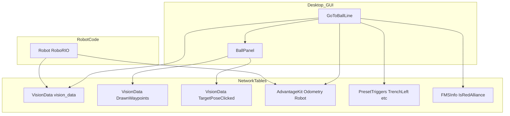
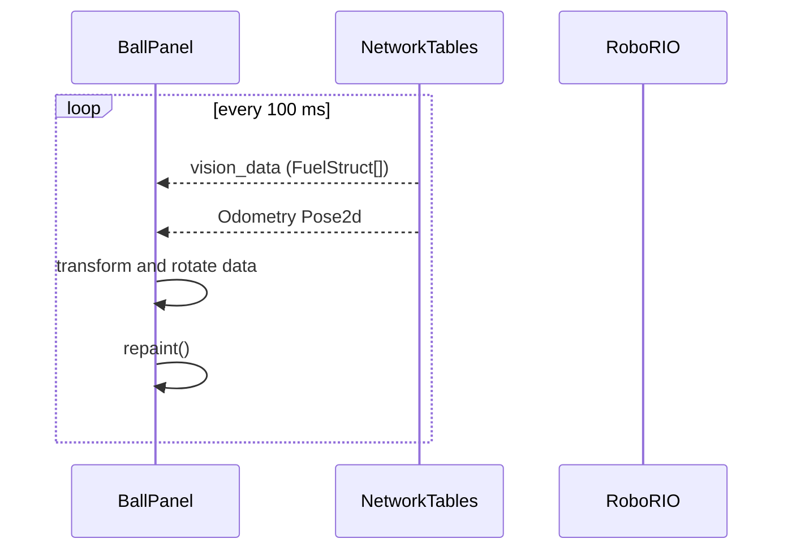
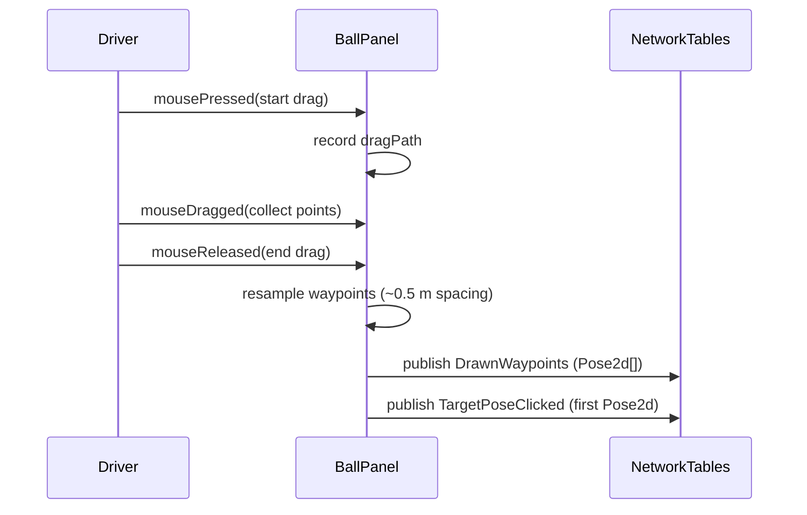

# GoToBallLine Feature Documentation

## Overview

GoToBallLine is a **desktop GUI tool** for FRC teams to visualize live field data, detected game pieces (fuel), and robot odometry in real time. It connects to a robot’s NetworkTables server, displays the field image, overlays ball positions and the robot’s pose, and lets users click or drag on the field to publish waypoints back to the robot.

This tool streamlines driver-station diagnostics and enables on-the-fly path planning without redeploying code.

## Architecture Overview

## Component Structure

### 1. Presentation Layer

#### **GoToBallLine** ()

- Purpose and responsibilities- Initializes NetworkTables client and topics
- Launches the Swing **JFrame** and adds the **BallPanel**
- Key Methods- `public static void main(String[] args)` - Configures NetworkTableInstance
- Subscribes/publishes topics
- Builds and displays the GUI

#### **BallPanel** (inner class)

- Purpose- Renders the field image, live fuel positions, and robot pose
- Handles mouse events for clicking and dragging to define waypoints
- Key Fields- `List<FuelStruct> vision_data` – current detected balls
- `boolean flipped` – true when red alliance (rotates field)
- `BufferedImage fieldImage` – rotated field image
- `List<double[]> dragPath` – raw drag coordinates in meters
- Key Methods- `paintComponent(Graphics g)` – draws field, balls, path, robot
- Mouse listeners (`mousePressed`, `mouseReleased`, `mouseDragged`, `mouseMoved`)- Compute waypoints, publish to NetworkTables
- `applyRotation()` and `detectFieldBoundaries()` – orient field for alliance side

### 2. Data & Subscription Layer

| Topic | Role | Type | Purpose |
| --- | --- | --- | --- |
| `VisionData/vision_data` | Subscriber | `FuelStruct[]` | Live fuel (ball) positions |
| `AdvantageKit/RealOutputs/Odometry/Robot` | Subscriber | `Pose2d` | Robot’s current field pose |
| `PresetTriggers/Trench Left` | BooleanPublisher | `boolean` | User-triggered “Trench Left” preset |
| `PresetTriggers/Trench Right` | BooleanPublisher | `boolean` | “Trench Right” preset |
| `PresetTriggers/ShootL, ShootM, ShootR` | BooleanPublishers | `boolean` | Shooting presets |
| `PresetTriggers/Outpost` | BooleanPublisher | `boolean` | Outpost preset |
| `FMSInfo/IsRedAlliance` | BooleanSubscriber | `boolean` | Alliance color (field flip logic) |
| `VisionData/DrawnWaypoints` | StructArrayPublisher<`Pose2d`> | `Pose2d[]` | User-drawn path waypoints |
| `VisionData/TargetPoseClicked` | StructPublisher<`Pose2d`> | `Pose2d` | First target pose after drag |

### 3. Internal Models

Ballclass Ball {
  double xMeters, yMeters;
  int radius = 10;
  Ball(double xMeters, double yMeters) { … }
  int getPixelX() { … }
  int getPixelY() { … }
  boolean contains(int px, int py) { … }
}PropertyTypeDescriptionxMetersdoubleX-coordinate on the field (meters)yMetersdoubleY-coordinate on the field (meters)radiusintHit detection radius in pixels

NavGridclass NavGrid {
  double fieldWidth, fieldHeight, nodeSize;
  boolean[][] grid;
  NavGrid(String jsonPath) { … } 
  boolean isWalkable(double x, double y) { … }
}PropertyTypeDescriptionfieldWidthdoubleField width used in nav JSONfieldHeightdoubleField height used in nav JSONnodeSizedoubleResolution of each grid cellgridboolean[][]Walkable (true) vs blocked (false)

Obstacleclass Obstacle {
  double xMeters, yMeters, radiusMeters;
  Obstacle(double x, double y, double r) { … }
  boolean contains(double x, double y) { … }
}PropertyTypeDescriptionxMetersdoubleObstacle center X (meters)yMetersdoubleObstacle center Y (meters)radiusMetersdoubleObstacle radius (meters)

## Feature Flows

### 1. Live Data Subscription & Rendering

### 2. User-Defined Path Publishing

## Error Handling

- **Field Image Loading**

Catches `Exception` when reading `f5h5pjh7whrmr0cwb1v9zgfp5r_result_0.png`. Logs to stderr and falls back to blank panel.

- **NavGrid JSON Parsing**

Catches I/O and parsing errors, prints stack trace, initializes empty grid to treat all points as walkable.

## Integration Points

- **Robot Code**- Consumes published waypoints from `VisionData/DrawnWaypoints` and `TargetPoseClicked` to drive autonomous routines.
- **Alliance Color Flip**- Subscribes to `FMSInfo/IsRedAlliance` to rotate the field image for red vs blue alliances.

## Key Classes Reference

| Class | Location | Responsibility |
| --- | --- | --- |
| GoToBallLine |  | Entry point; sets up NetworkTables & GUI |
| BallPanel | Inner class in `GoToBallLine.java` | Renders field & handles user input |
| Ball | Inner class in `GoToBallLine.java` | Visual hit-testing of individual balls |
| NavGrid | Inner class in `GoToBallLine.java` | Loads and queries walkability grid from JSON |
| Obstacle | Inner class in `GoToBallLine.java` | Represents circular obstacles (unused in current UI) |

## Dependencies

Ensure the NetworkTables server address (10.22.7.2:5810 by default) matches the robot’s team number or localhost in simulation.

- Java 17
- WPILib: NetworkTables, Math (Pose2d, Rotation2d)
- Java Swing & AWT: `JFrame`, `JPanel`, `Timer`, `Graphics2D`
- `javax.imageio.ImageIO` for image loading

## Testing Considerations

- **Visual Verification**: Confirm correct rendering of balls and robot pose under different alliance colors.
- **Interaction Tests**: Validate click & drag publish correct waypoints to NetworkTables.
- **Error Paths**: Simulate missing image or invalid JSON to verify graceful fallback.